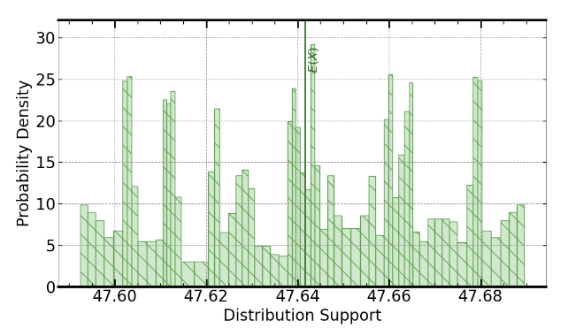
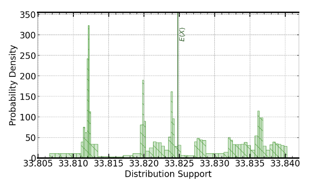
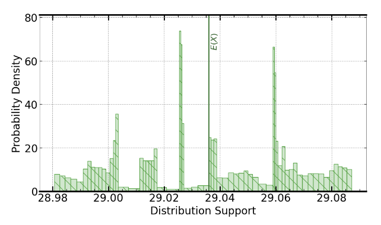
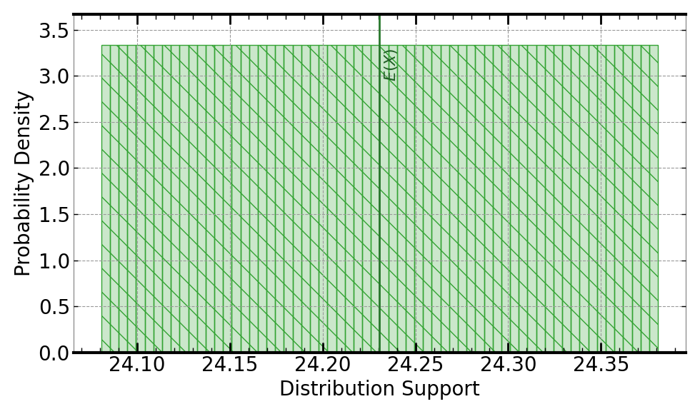
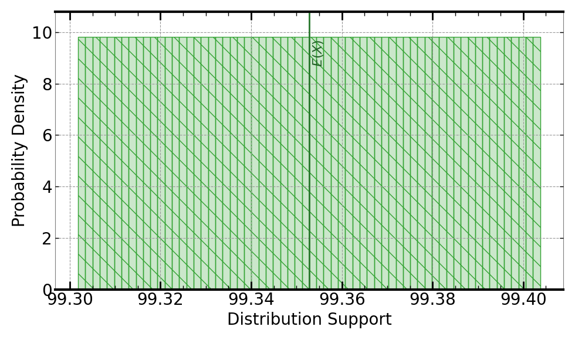
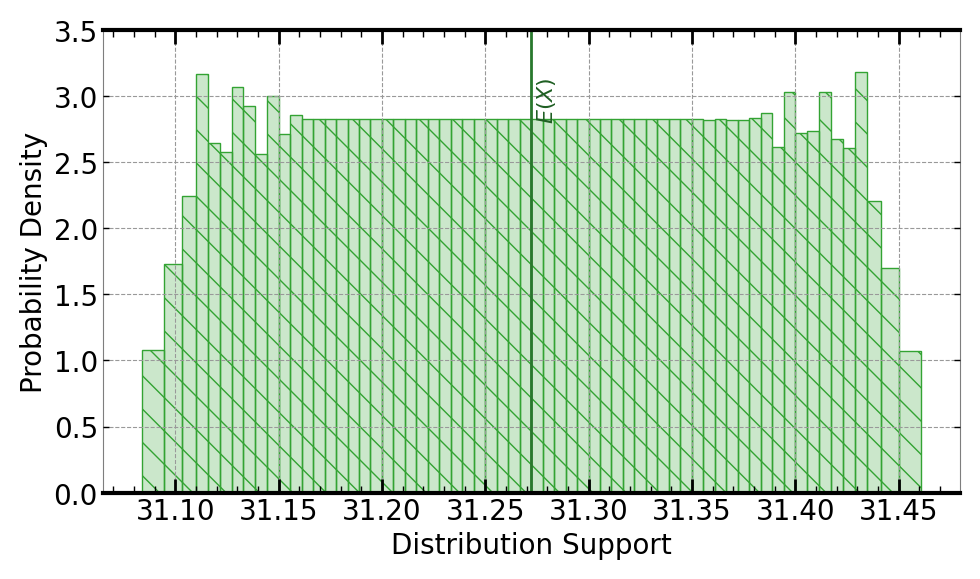

[](https://signaloid.io/repositories?connect=https://github.com/signaloid/Signaloid-Demo-Sensors-BME680ConversionRoutines#gh-dark-mode-only)
[](https://signaloid.io/repositories?connect=https://github.com/signaloid/Signaloid-Demo-Sensors-BME680ConversionRoutines#gh-light-mode-only)

https://github.com/signaloid/Signaloid-Demo-Sensors-BME680ConversionRoutines/assets/46606149/bcb88988-b10f-4cb4-9b7f-07ce129887ad

# Bosch BME680 Sensor Calibration Algorithms
Modern sensors use transducers to convert the physical signal they want to measure, into a voltage signal which is then
digitized using analog-to-digital converters (ADC).
Systems integrating these sensors use calibration algorithms specific to the sensor to convert this digital voltage signal 
to a meaningful measurement of the physical signal (e.g., a temperature in degrees Celsius).
Even if the measured signal stays fixed, the digitized value will fluctuate. 
Systems incorporating sensors today workaround this _uncertainty_ by averaging the signal over a time period to get a single number. 
This example shows how uncertainty-tracking computing systems can let you get a more realistic view of
what a sensor is really measuring, by tracking how uncertainties in a sensor's raw digitized 
ADC readings, as well as uncertainties in other calibration
parameters, affect an unmodified version of the sensor calibration algorithm of one
commercially-available thermal sensor array, BME680 from Bosch[^0][^1].

## Getting started
The correct way to clone this repository to get the submodules is:
```sh
	git clone --recursive git@github.com:signaloid/Signaloid-Demo-Sensors-BME680ConversionRoutines.git
```

If you forgot to clone with `--recursive` and end up with empty submodule directories, you can remedy this with:
```sh
	git submodule update --init
```

## Running the application on the Signaloid Cloud Developer Platform
To run this application on the [Signaloid Cloud Developer Platform](https://signaloid.io),
you need a Signaloid account. You can sign up for a Signaloid account using [this link](https://get.signaloid.io).

Once you have a Signaloid account, you can click the "add to signaloid.io" button at the
top of this `README.md` to connect this repository to the Signaloid Cloud Developer Platform
and run the application.

## Running the application locally
Apart from using Signaloid's Cloud Compute Platform, you can compile and run this application
locally. Local execution is essentially a native Monte Carlo implementation,
that uses GNU Scientific Library[^GSL] to generate samples for the different input distributions.
In this mode the application stores the generated output samples, in a file called `data.out`.
The first line of `data.out` contains the execution time of the Monte Carlo implementation
in microseconds (μs), and each next line contains a floating-point value corresponding to an output sample value.

In order to compile and run this application in the native Monte Carlo mode:

0. Install dependencies (e.g., on Linux):
```
sudo apt-get install libgsl-dev libgslcblas0
```
1. Compile natively (e.g., on Linux):
```
cd src/
gcc -I. -I./BME680-patched-driver -I/opt/local/include main.c utilities.c common.c uxhw.c BME680-patched-driver/bme680.c -L/opt/local/lib -o native-exe -lgsl -lgslcblas -lm
```
2. Run the application in the MonteCarlo mode, using (`-M`) command-line option:
```
./native-exe -M 10000
```
The above program runs 10000 Monte Carlo iterations.
3. See the output samples generated by the local Monte Carlo execution:
```
cat data.out
```

## Inputs
The inputs to the BME680 sensor calibration algorithms are the raw ADC readings taken from the pressure, temperature, and
humidity transducers on a BME680 sensor. In this example, we sample the temperature in a room at a rate of approximately
30 samples/second (30Hz). This sampling rate is much higher than the rate at which the corresponding temperature, barometric
temperature, or humidity can change. Nevertheless, in repeating the measurements, we see variation in the raw ADC readings[^2][^3].
The plots below show the distributions of the raw ADC readings that we used for this example:

### Raw Temperature ADC Readings:


### Raw Pressure ADC Readings:


### Raw Humidity ADC Readings:


## Outputs
The Bosch BME680 sensor calibration algorithms calculate the calibrated values for `pressure`, `temperature`, and `humidity`
given the corresponding raw ADC readings. They use numerous calibration parameters as shown in the code snippet below from
[the reference calibration routine code from Bosch](https://github.com/BoschSensortec/BME680_driver/tree/9014031fa00a5cc1eea1498c4cd1f94ec4b8ab11),
which takes as input the raw temperature ADC reading (`temp_adc`) and the calibration parameters (`par_t1`, `par_t2`, and
`par_t3`) and outputs the calibrated tempterature (`calc_temp`).
```c
float
calc_temperature(float temp_adc, float par_t1, float par_t2, float par_t3)
{
        float var1 = 0;
        float var2 = 0;
        float calc_temp = 0;

        /* calculate var1 data */
        var1  = (((temp_adc / 16384.0f) - (par_t1 / 1024.0f))
                        * (par_t2));

        /* calculate var2 data */
        var2  = ((((temp_adc / 131072.0f) - (par_t1 / 8192.0f)) *
                ((temp_adc / 131072.0f) - (par_t1 / 8192.0f))) *
                (par_t3 * 16.0f));

        /* t_fine value */
        float t_fine = (var1 + var2);

        /* compensated temperature data */
        calc_temp  = ((t_fine) / 5120.0f);

        return calc_temp;
}
```

Following is an example output, using Signaloid's C0Pro-XS+ core, for the default inputs:

- Output temperature:


- Output pressure:


- Output humidity:


## Usage
```
Example: BME680 sensor calibration routines - Signaloid version

Usage: Valid command-line arguments are:
        [-o, --output <Path to output CSV file : str>] (Specify the output file.)
        [-S, --select-output <output : int> (Default: 0)] (Compute 0-indexed output.)
        [-M, --multiple-executions <Number of executions : int> (Default: 1)] (Repeated execute kernel for benchmarking.)
        [-T, --time] (Timing mode: Times and prints the timing of the kernel execution.)
        [-v, --verbose] (Verbose mode: Prints extra information about demo execution.)
        [-b, --benchmarking] (Benchmarking mode: Generate outputs in format for benchmarking.)
        [-j, --json] (Print output in JSON format.)
        [-h, --help] (Display this help message.)
        [-m, --measurements-prefix <prefix of input ADC traces files : str> (Default: 'warp-board-002')]
        [-c, --calibration-constants-prefix <prefix of calibration constants files : str> (Default: 'BME680-par')]
        [-n, --calibration-parameter-index <index of calibration parameter: int in [0, 4]> (Default: 0)]
        [-t, --override-temperature-measurement <temperature measurement : str> (Default: '')]
        [-p, --override-pressure-measurement <pressure measurement: str> (Default: '')]
        [-u, --override-humidity-measurement <humidity measurement: str> (Default: '')]
```


<br/>
<br/>
<br/>

[^0]: Bosch Sensortec, [BME680 Datasheet](https://www.bosch-sensortec.com/products/environmental-sensors/gas-sensors/bme680/), 2020.

[^1]: T. Newton, J. T. Meech, and P. Stanley-Marbell, ["Machine Learning for Sensor Transducer Conversion Routines"](https://physcomp.eng.cam.ac.uk/machine-learning-for-sensor-transducer-conversion-and-calibration-routines/). IEEE Embedded Systems Letters, 2021.

[^GSL]: [GNU Scientific Library](https://www.gnu.org/software/gsl/).

[^2]: The [Status Quo on Dealing with Measurements and Uncertainty (text)](https://f-of-e.github.io/HtmlChapters/chapter-02-measurements-and-uncertainty/chapter-02-measurements-and-uncertainty.html) that only works for a restricted set of real-world cases.

[^3]:  The [Status Quo on Dealing with Measurements and Uncertainty (video)](https://f-of-e.org/chapter-02) that only works for a restricted set of real-world cases.
